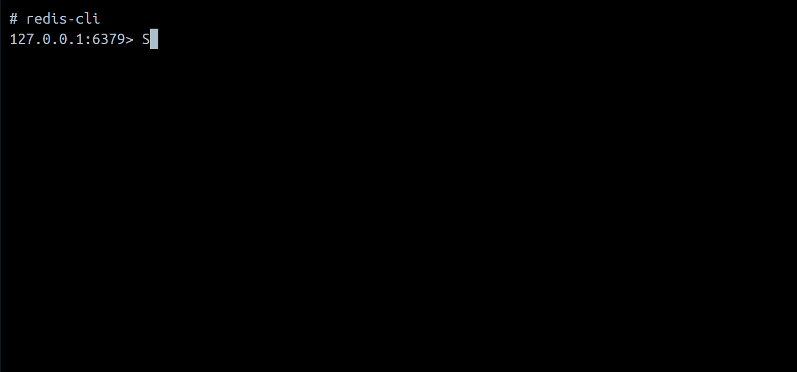
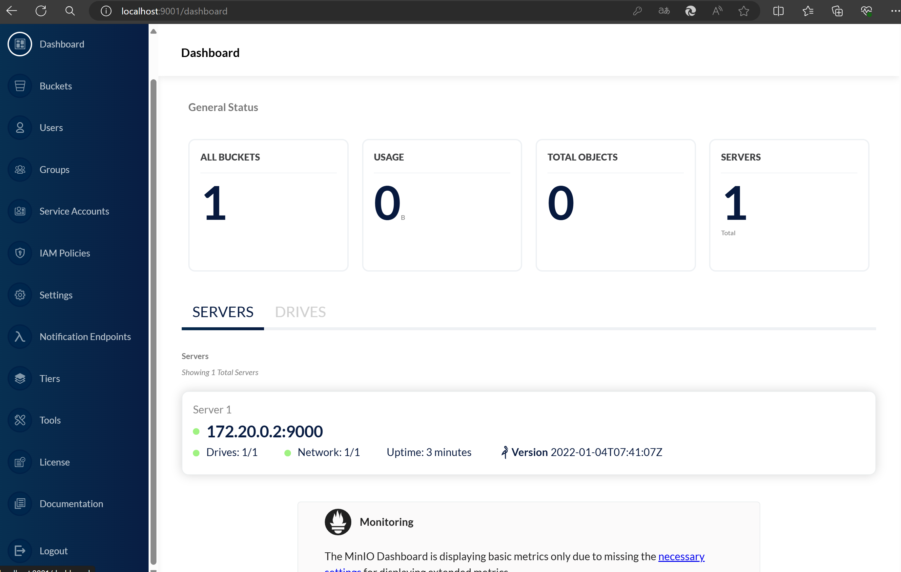
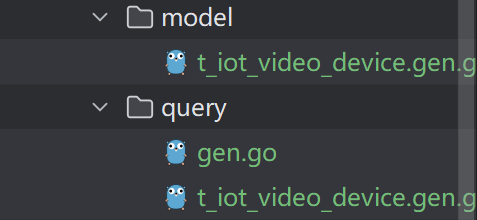

# ginserve

## 介绍
以gin框架为核心的webservice服务，包含grom，minio，postgreSQL的包装。

## 软件架构
软件架构说明


##  安装教程

1.  git clone  xxxx
2.  rename project name
3.  go mod tidy

## 使用说明


#### 安装与环境


确保环境为go环境，版本为1.22.4，配置环境

```shell
GOPROXY=https://goproxy.cn

GOPATH=/xxx/xxx
```

```go
1. 拉取项目
git clone xxx

2. 下载依赖
go mod tidy

3. 启动
go run main.go
```

#### 目录介绍

原文连接：https://learnku.com/docs/gin-pro/1.0/mu-lu-jie-gou/15980


````shell
├── app -- 核心代码
│   ├── controller    -- 控制器 
│   │   ├── container.go
│   │   └── ...
│   ├── global      -- 通用常量
│   │   └── consts
│   ├── logic    -- 逻辑层
│   └── util   -- 工具模块
├── config  -- 配置文件信息
│   └── config.yml
├── database    -- 数据库相关
│   └── readme.md
├── boostrap    -- 在程序启动时 最先执行的初始化函数
│   └── init.go
├── go.mod
├── go.sum
├── library -- 外部依赖封装
│   ├── config
│   │   ├── config.go
│   │   └── iconfig
│   │       └── iconfig.go
│   ├── mysql_gorm
│   │   ├── client.go
│   │   ├── custom_log.go
│   │   └── hook.go
│   ├── release_router
│   │   └── release_router.go
│   ├── snow_flake
│   │   └── snow_flake.go
│   ├── validator_translation
│   │   └── validator_transiation.go
│   └── zap_log
│       ├── zap_log.go
│       └── zap_log_hook
│           └── zap_log_hooks.go
├── main.go
├── public    -- 静态文件 
├── router     -- 路由模块 
│   ├── router.go
│   └── middleware
├── storage     --日志文件及资源文件
│   ├── app
│   │   └── imgs
│   │       └── img.png
│   └── logs
├── template    -- 模板文件
│   └── index.tpl
````

#### 技术栈

1. 语言go
2. web框架gin
3. orm框架gorm
4. 中间件存储文件框架minio,数据存储框架redis
5. 数据库postgres


#### 中间件搭建

1. redis为docker环境

```shell
docker pull redis
docker run -P --name redis redis
```



2. minio搭建

docker-compose up -d 运行

```shell
version: '3'
services:
  minio:
    image: minio/minio
    hostname: "minio"
    ports:
      - 9100:9000 # api 端口
      - 9001:9001 # 控制台端口
    environment:
      MINIO_ACCESS_KEY: minioadmin    #管理后台用户名
      MINIO_SECRET_KEY: minioadmin #管理后台密码，最小8个字符
    volumes:
      - ../minio/data:/data               #映射当前目录下的data目录至容器内/data目录
      - ../minio/config:/root/.minio/     #映射配置目录
    command: server --console-address ':9001' /data  #指定容器中的目录 /data
    privileged: true
    restart: always
```




#### 命令

1. gen

数据库表通过gen框架映射为strcut结构体，在cmd目录gen.go添加表名即可。 会生成query和model目录，如下：




#### 注意

1. 数据库表约束

+ 数据库映射的结构体统一用驼峰命令法，数据库表转为相应的下划线末尾加s （gorm映射规则）
+ 每个表均有createtime，updatetime，deletetime，且三个时间无需定义使用grom.Model,删除为假删除使用deletetime做标识


## 参与贡献

1.  Fork 本仓库
2.  新建 Feat_xxx 分支
3.  提交代码
4.  新建 Pull Request


## 特技

1.  使用 Readme\_XXX.md 来支持不同的语言，例如 Readme\_en.md, Readme\_zh.md
2.  Gitee 官方博客 [blog.gitee.com](https://blog.gitee.com)
3.  你可以 [https://gitee.com/explore](https://gitee.com/explore) 这个地址来了解 Gitee 上的优秀开源项目
4.  [GVP](https://gitee.com/gvp) 全称是 Gitee 最有价值开源项目，是综合评定出的优秀开源项目
5.  Gitee 官方提供的使用手册 [https://gitee.com/help](https://gitee.com/help)
6.  Gitee 封面人物是一档用来展示 Gitee 会员风采的栏目 [https://gitee.com/gitee-stars/](https://gitee.com/gitee-stars/)
